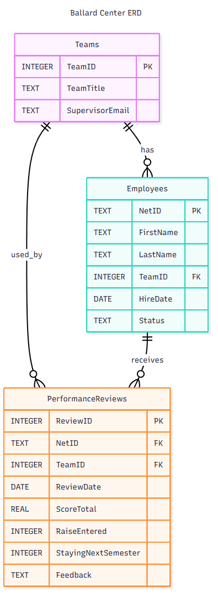

# Ballard-Center-Database-Query-Tool

This sample shows how to **pull SharePoint list items live** via **Microsoft Graph**, materialize them into an **in-memory SQLite** database, and then run a **natural language > SQL > rows > natural language** loop with OpenAI.

## What you need

- Python 3.10+
- An **Entra ID app registration** with permission **`Sites.Read.All`** (delegated). Admin consent required.
- Your **Tenant ID** and **Client ID** for Device Code auth.
- Your **OpenAI API key** in `OPENAI_API_KEY`.

## Setup

```bash
python -m venv .venv && source .venv/bin/activate    # (on Windows: .venv\Scripts\activate)
pip install -r requirements.txt
cp config/.env.example config/.env
# Edit config/.env with your Tenant/Client IDs, SharePoint site, list titles, etc.
```

## Run

```bash
python app.py
# Follow the device-code link to sign in.
# When prompted, type a natural-language question, e.g.:
# "Which five employees have the highest review scores with their team names?"
```

## Notes

- We build a **clean relational schema** (Employees, Teams, PerformanceReviews) from the raw SharePoint fields.
- The SQLite database lives in memory for each run; tweak `DB_MODE` in `.env` to persist to `ballard_center.db` for debugging.
- We log each Q > SQL > rowcount in `logs/` (JSONL).


## Mermaid Schema


